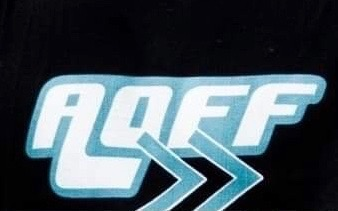

---
#
# By default, content added below the "---" mark will appear in the home page
# between the top bar and the list of recent posts.
# To change the home page layout, edit the _layouts/home.html file.
# See: https://jekyllrb.com/docs/themes/#overriding-theme-defaults
#
layout: home
---

# Finess Your Fears
## Inspiration

## Design

## Shirt

# No Rookie
## Inspiration

## Design

## Shirt

# Beat The Odds

## Inspiration

## Design

## Shirt

# Active Wear

## Inspiration

## Design

## Shirt

# Fitness Gear

## Inspiration

## Design

## Shirt

